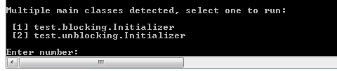

A Ping Pong Scala Akka Actors Example
-----------

Introduction
------------
This example uses Akka actors to implement a ping pong game. There are two versions of the application, i.e. blocking and unblocking. The unblocking version uses [Futures](http://doc.akka.io/docs/akka/snapshot/scala/futures.html) to get the Pong response. 

How to build and run
----------------------------------------

Use the following command:

	$ sbt clean compile run

You will see the message shown in the following screenshot asking to select the main class to run. To run the blocking version type 1 and for the unblocking version type 2.

